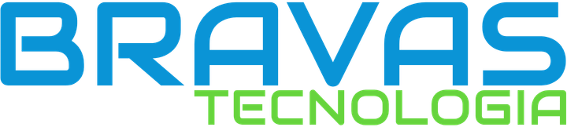

 

Empresa brasileira especializada no desenvolvimento de soluções para **Controle de Acesso**, **Automação Predial**, **Segurança Eletrônica** e **Gestão de Estacionamentos**.

**Tecnologia, Engenharia e Produção 100% Brasileira**

 

---

# Sobre a Bravas

A **Bravas Tecnologia** é uma empresa brasileira de base tecnológica dedicada ao desenvolvimento e fabricação de equipamentos de alta performance para:

- 🚪 Controle de Acesso
- 🏢 Automação Predial
- 🚗 Gestão de Estacionamentos
- 🛡️ Segurança Eletrônica

Todo o ciclo de desenvolvimento é realizado internamente, desde a concepção até a fabricação dos produtos.

Nossa engenharia é responsável pelo desenvolvimento de:

- Hardware
- Firmware
- Software

Essa autonomia tecnológica garante maior confiabilidade, evolução contínua dos produtos e suporte altamente especializado.

---

# Engenharia 100% Brasileira

Temos orgulho de desenvolver tecnologia nacional.

Todo o processo de Pesquisa & Desenvolvimento (P&D) acontece dentro da Bravas Tecnologia, permitindo inovação constante e independência tecnológica.

## Diferenciais

- 🇧🇷 Desenvolvimento nacional
- ⚙️ Hardware próprio
- 💻 Software próprio
- 🔧 Firmware próprio
- 🚀 Evolução contínua
- 🛡️ Alta confiabilidade
- 🤝 Suporte técnico especializado

---

# Segmentos Atendidos

Nossas soluções estão presentes em projetos por todo o território nacional.

- 🏢 Condomínios
- 🎓 Escolas
- 🏥 Hospitais
- 🏭 Indústrias
- 🚚 Centros Logísticos
- 🚗 Estacionamentos
- 🏢 Empresas de diversos segmentos

---

# Integrações

Os equipamentos Bravas operam em perfeita sintonia com os principais softwares de gerenciamento do mercado.

Suporte para integração com:

- RFID
- Antenas UHF
- Biometria
- Reconhecimento Facial
- Sistemas de terceiros
- Automações avançadas

---

# Contato

🌐 [Bravas Tecnologia](https://www.bravas.ind.br)

### WhatsApp

💬 (11) 2924-7613

---

# Redes Sociais

- Instagram: **@bravastecnologia**
- Facebook: **/bravastecnologia**
- LinkedIn: **Bravas Tecnologia**
- YouTube: **@bravastecnologia**

---

**[Bravas Tecnologia](https://www.bravas.ind.br)**

